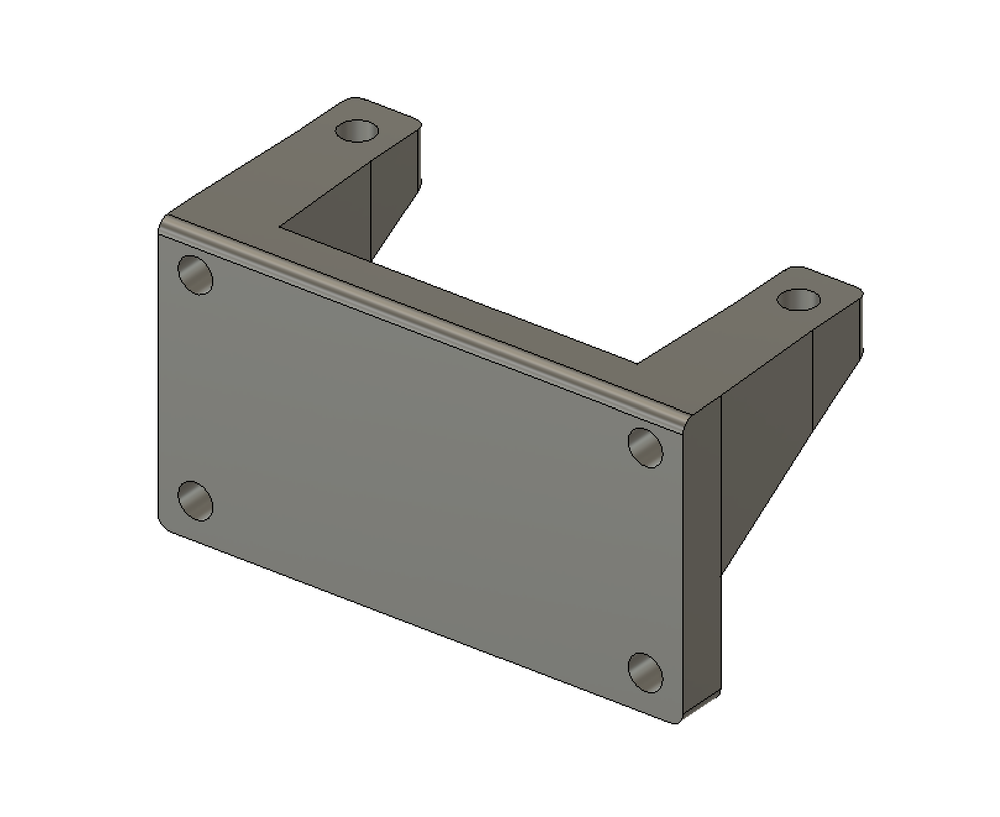
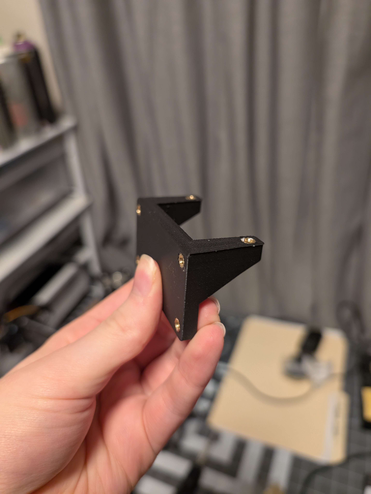
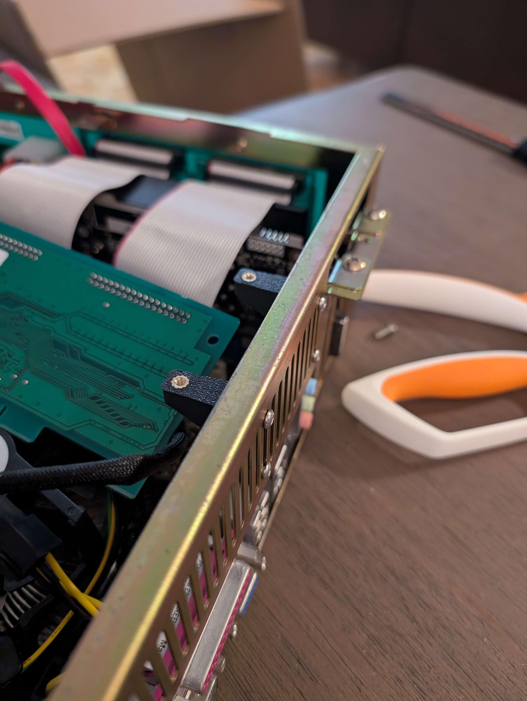
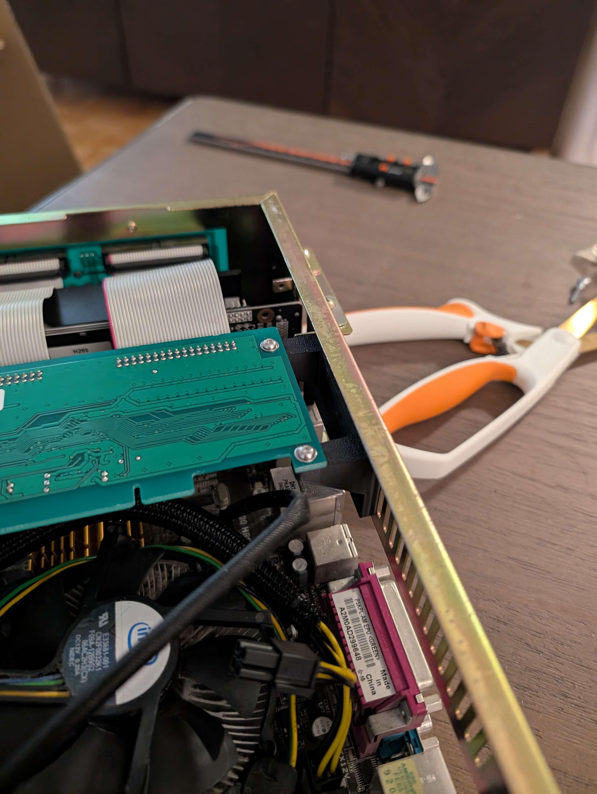

# MK6 PIUIO Mount

Since the PIUIO is only designed to go in an AGP slot, when I upgraded my MK6 to modern hardware I had to figure out a new solution to mount it. My friend suggested I mount it using the vent holes in the case, and that's what I ended up doing.

## Hardware

- 6x M3x4x5 Heat Set Insert
- 6x M6x6 Truss-head Screw

## Pictures

